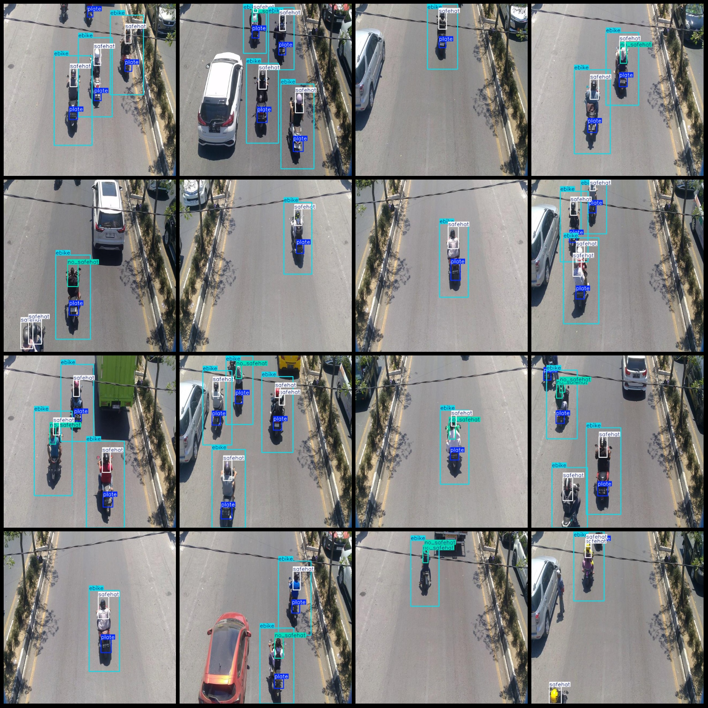
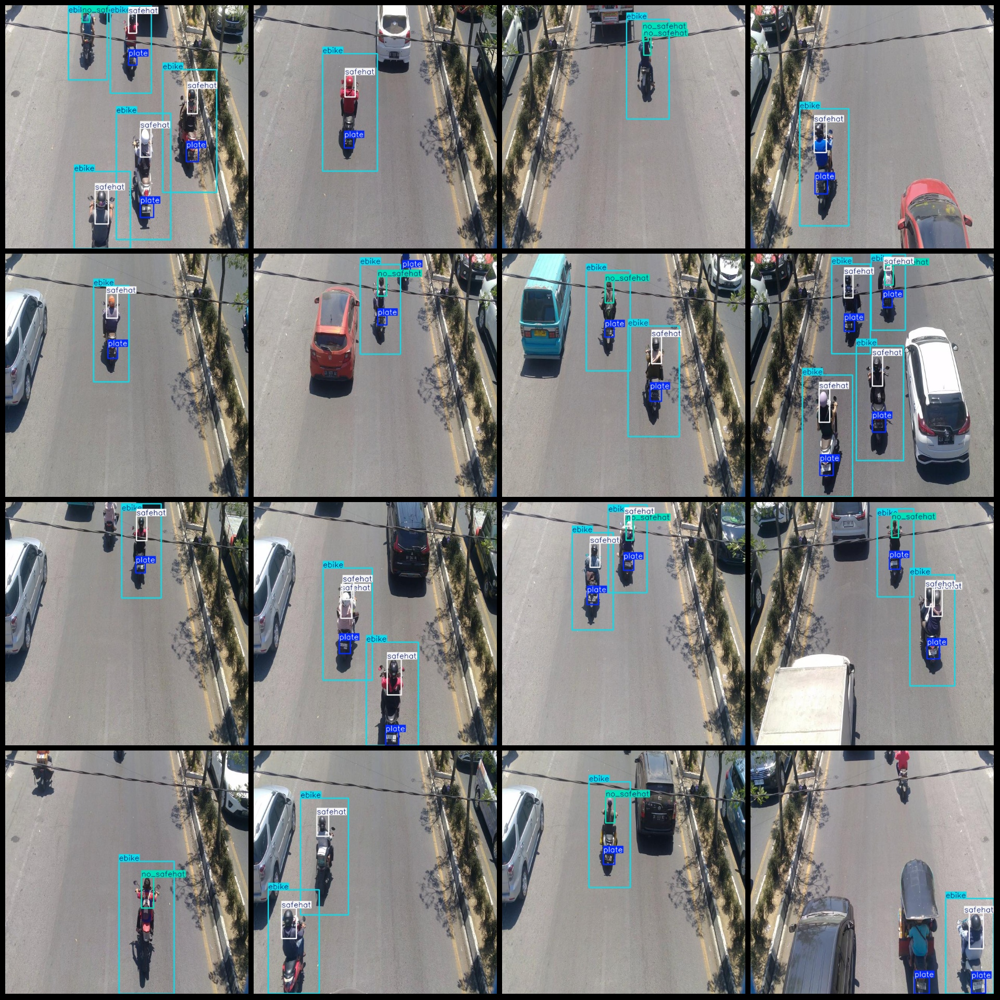

# Road Traffic Vehicle and Motorcycle Helmet Wear Detection Dataset VOC+YOLO Format, 2308 Images in 4 Categories

Dataset format: Pascal VOC format + YOLO format (txt file without split path, only containing jpg images and corresponding VOC format xml files and yolo format txt files)
Number of images (jpg file count): 2308
Number of annotations (xml file count): 2308
Number of annotations (txt file count): 2308
Number of annotator categories: 4
Annotation category names according to the order in labels folder (classes.txt): ["ebike", "no_safehat", "plate", "safehat"]
Boxes per category:
- ebike (electric bike) boxes = 4460
- no_safehat (without a helmet) boxes = 1448
- plate (license plate) boxes = 4865
- safehat (with a helmet) boxes = 4400
Total boxes: 15173
Number of images per category:
- ebike (electric bike) images = 2287
- no_safehat (without a helmet) images = 1239
- plate (license plate) images = 2164
- safehat (with a helmet) images = 2111
Image resolution: 640x640
Annotation tool used: labelImg
Annotation rules: draw rectangles around categories
Important note: The dataset does not have separate training, validation, or test sets; users must manually divide them.
Special declaration: This dataset does not guarantee any accuracy of the trained models or weight files.
Image preview:
Annotation examples:

## Images

Here is a pay link on Stripe ( https://buy.stripe.com/3cs8yP7sY87d0vu9AB ). Please contact me lonlonago@foxmail.com after funding $89, and I will send you a complete data files , thank you!

